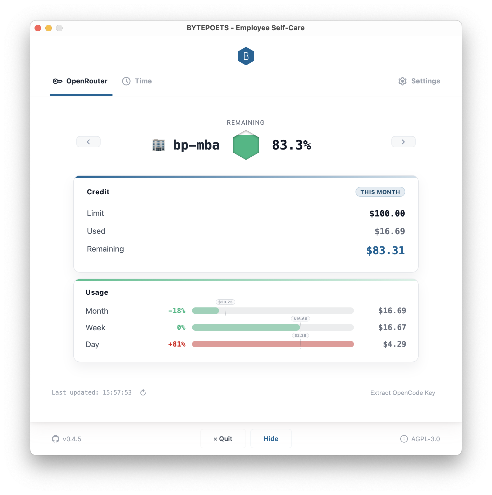

# BYTEPOETS Employee Self-Care (ESC)

**Internal tool — BYTEPOETS GmbH employees only**

Warm, focused macOS companion for OpenRouter usage: quick insight, calm pacing, and a menubar heartbeat for your budget.

## Features

- **Live OpenRouter balance** with limit/used/remaining, month/week/day breakdowns, and pace cues
- **Menubar status icon** that mirrors your current percentage at a glance
- **Used vs remaining mode** with percent/$ view and decimal precision controls
- **Auto-refresh** that keeps data up to date even when the window is hidden
- **Multi‑key management** with labels, quick switching, and drag‑to‑reorder
- **OpenCode key extractor** that can switch to an existing key or prefill a new one
- **Native macOS quality‑of‑life**: launch at login, global shortcut, always‑on‑top, dim unfocused
- **Auto updates** via Sparkle with one‑click manual checks
- **Debugging tools**: optional log file, debug bar, and in‑app log drawer
- **Safe local storage** under `~/.config/bpesc-balance/` with strict file permissions

## Quick Start

1. Launch `BYTEPOETS - ESC.app`
2. Add your OpenRouter key in Settings
3. Track balances, pace, and remaining budget in the OpenRouter tab

## Security Note

Your API key stays on your machine. Keep local config files private and never commit them.

## Auto-Updates

Sparkle handles native macOS updates and signatures. Manual check: Settings → “Check for Updates”.

## Technical Docs

See `docs/TECHNICAL-GUIDE.md` for versioning, update flow, and security details.

---

© 2026 BYTEPOETS GmbH — Internal Use Only
